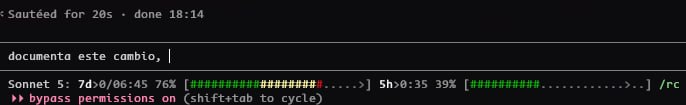

# claude-code-limits-statusline

A drop-in `statusLine` script for [Claude Code](https://claude.com/claude-code) that shows your **5-hour** and **7-day** rate-limit usage as two progress bars — plus a live countdown to each window's reset, and a time-progress marker so you can tell at a glance whether you're burning quota faster or slower than the clock.



```
Sonnet 5: 7d>0/06:45 76% [##################.....>..] 5h>0:35 39% [#########..............>..]
```

## What it shows

- **`7d>0/06:45`** — bold label + countdown to the 7-day window reset, `days/HH:MM`.
- **`76%`** — percentage of the 7-day quota used.
- **`[bar]`** — 25-char bar. The filled portion (green → yellow → red as it fills) is **usage %**. A single `>` character is overlaid at the position corresponding to **% of the window's time elapsed** — it takes the color of whatever it's sitting on (a filled segment's color, or gray if it's over an empty `.`).
- Same for the 5-hour window (`5h>H:MM`).

If usage% is way ahead of the `>` marker, you're burning quota faster than the window is ticking down — useful to know before you hit a wall.

## Install

1. Save `statusline.sh` somewhere, e.g. `~/.claude/statusline.sh`, and make it executable:
   ```bash
   chmod +x ~/.claude/statusline.sh
   ```
2. Point Claude Code at it in `~/.claude/settings.json`:
   ```json
   {
     "statusLine": {
       "type": "command",
       "command": "/home/you/.claude/statusline.sh"
     }
   }
   ```
3. Requires `bash` and `jq`. That's it — no other dependencies.

## Why this exists

Claude Code's statusLine hook receives a JSON payload on stdin that includes (for Pro/Max subscribers, or behind a gateway with spend limits) `rate_limits.five_hour` and `rate_limits.seven_day`, each with `used_percentage` and `resets_at` (Unix epoch seconds). This script turns those two numbers per window into one line that's actually useful to glance at while you work — not just "how much have I used" but "how much have I used *relative to how much time is even left*".

## Notes

- Not a Claude Code plugin — as of writing, the plugin manifest only lets plugins set the `agent` and `subagentStatusLine` settings keys, not the main `statusLine` command. This has to be wired up manually per the Install steps above.
- If `rate_limits` isn't present in the payload (free tier, or not yet populated on the first response), the script just prints the model name with no bars — it degrades gracefully, doesn't error out.
